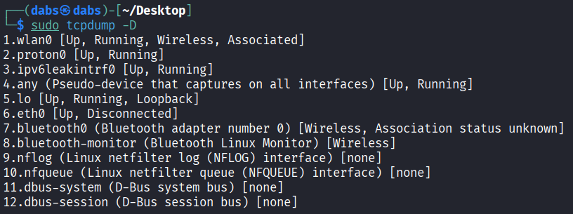
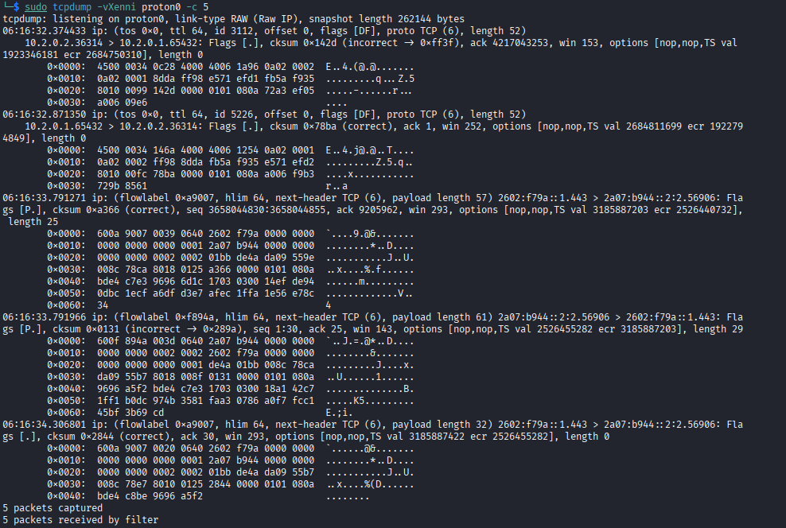
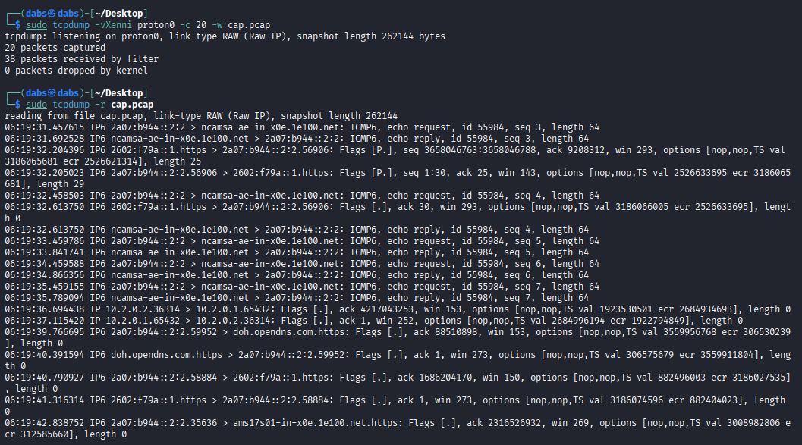
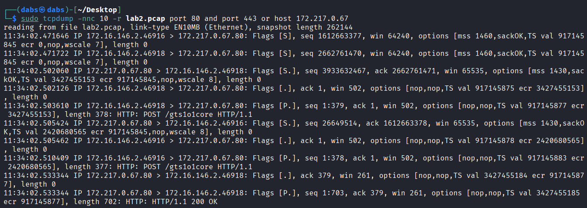

# Tcpdump
Command-line packet sniffer that can directly capture and interpret data frames from a file or network interface. To capture network traffic from "off the wire," it uses the `pcap` and `libpcap` libraries, paired with an interface in promiscuous mode to listen for data. This allows the program to see and capture packets sourcing from or destined for any device in the local area network. Due to the direct access to the hardware `root` privileges are required to run the tool.

## Basic Commands
`tcpdump` - Command to run tcpdump.
- `-h` - tcpdump use help.
- `-D` - List interfaces available for capture.

  

- `-i` - Select interface to capture from.
- `-c` - Specify number of packets to capture such as: `-c 10` (captures  10 packets and stops)
- `-n` - Disables IP address resolution, displays raw IP addresses numbers.
- `-nn` - Disables both IP address and port/service resolution.
- `-e` - Includes ethernet headers in capture output, displays MAC addresses.
- `-X` - Displays packet contents in hex and ASCII
- `-XX` - Same as `-x` but includes ethernet headers. Same as using `-Xe`
- `-v, -vv, -vvv` - Increase output verbosity.
- `-s` - Specify maximum amount of data (bytes) to capture from packets.
	- `-s 0` - Full capture
	- `-s 64` - Packet header only (default)
	- -`s 1500` - Custom length

  

- `-r` - Read from a file.
- `-w` - Write to a file.

  

## Packet Filtering
```bash
tcpdump <flags> <filters>
```
- `host` - Filter by IP address.
- `port` - Filters by port. To specify a range of ports use `port`.
	Both are bi-directional that is, filters for both source and destination IP/port. Equivalent to: `src host <IP/port> OR dst host <IP/port>` 
	-- `src host/port` - Filters by source host IP/port.
	-- `dst host/port` - Filters by destination IP/port.
- `proto` - Filters by a specific protocol.
- `and / &&` - Both filter conditions are true such as: `src host <IP> && port <PORT>`
- `or` - Allows for a match on either two filter conditions such as: `src host <IP> or dst host <IP>`



- `not` - Negates a condition to output all except the specified condition such as: `tcpdump not udp` or `tcpdump not port 22` 
	These can be concatenated such as: `tcpdump (port 80 or 443) and host 192.168.1.10 not tcp`
- `less / < & greater / >` - Filter by packet size (bytes)
	- `tcpdump greater/> 1000` - Packets larger than 1000 bytes.
	- `tcpdump less/< 1000` - Packets less than 1000 bytes.
- `net` - Filters for traffic coming from or going to an entire network (subnet) instead of a single IP.
	- `tcpdump net 192.168.1.0/24` - Packets going to or coming from that subnet. 
	- Can also use `src` and `dst` modifiers.
