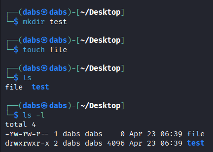
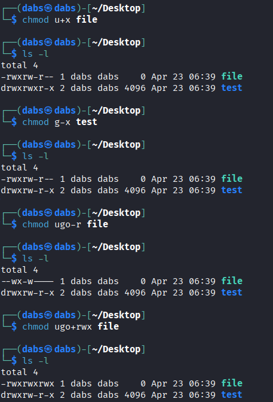
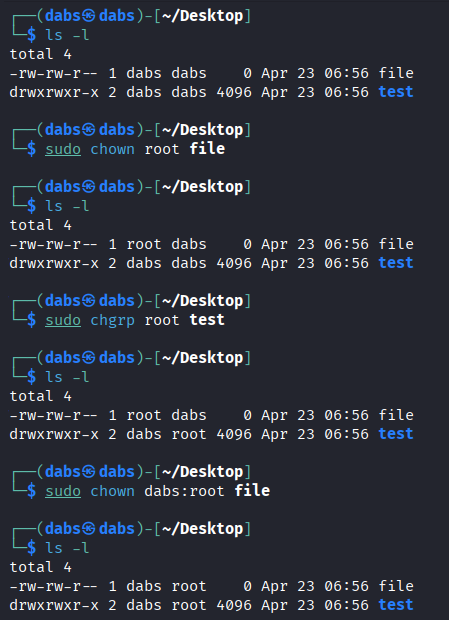
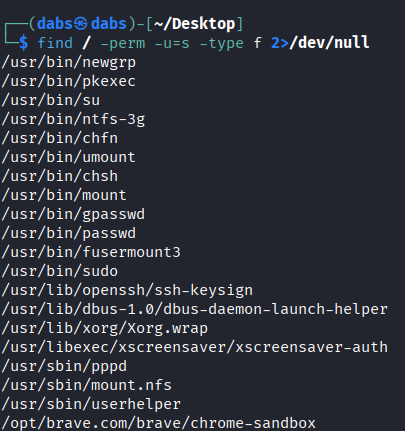
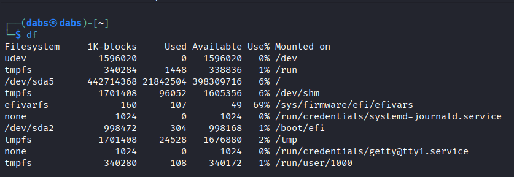
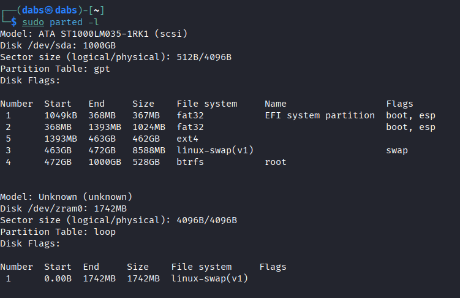
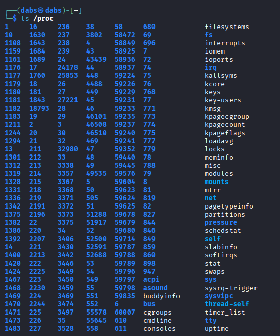
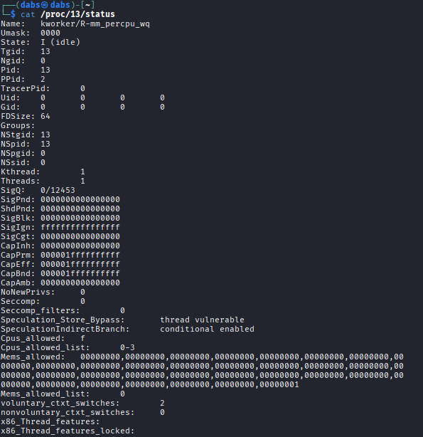
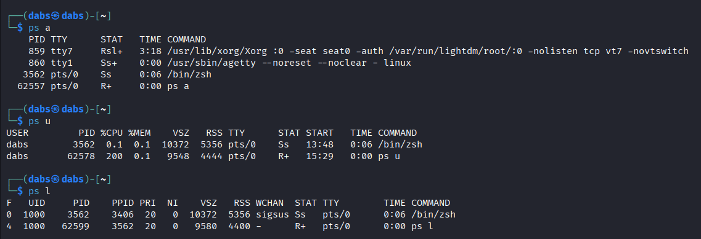
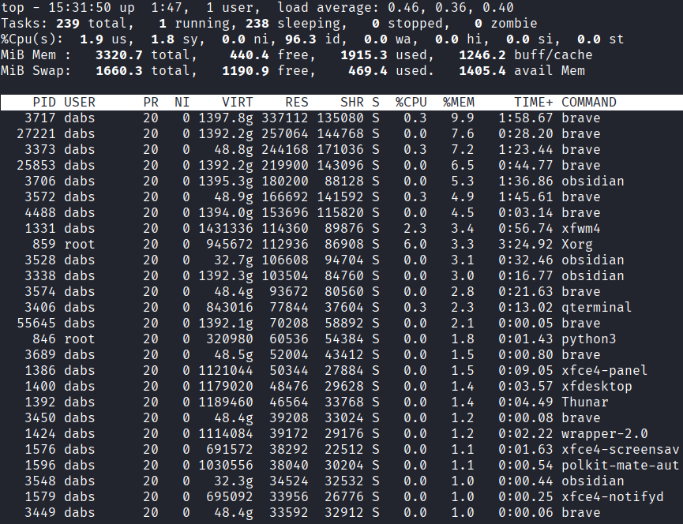

# Basic Commands Cheatsheet
## Linux Filesystem & Permissions
- `ls` - Lists all files and directories in current working directory:
	- `ls dirname` - Lists all under specified directory
	- `ls /path/to/dir` - Absolute path listing to a specific dir such as `ls /usr/share`
	- `ls -a` - Also lists hidden files
	- `ls -l` - Long listing: Shows filename, type *directory (d), file (-), symbolic link (l)*, permissions, owner, group, size, timestamp.
## Linux Filesystem Hierarchy
```bash
ls -l /
```
Lists all directories listed under the root directory. Some of the most important ones include:
- / - The root directory of the entire filesystem hierarchy, everything is nestled under this directory. **Not listed after `ls -l /`**
- /bin - Essential ready-to-run programs (binaries), includes the most basic commands such as ls and cp.
- /boot - Contains kernel boot loader files.
- /dev - Device files.
- /etc - Core system configuration directory, should hold only configuration files and not any binaries.
- /home - Personal directories for users, holds your documents, files, settings, etc.
- /media - Used as an attachment point for removable media like USB drives.
- /mnt - Temporarily mounted filesystems.
- /usr - This holds user installed software and utilities. Inside this directory are sub-directories for /usr/bin, /usr/local, etc.
- /var - Variable directory, it's used for system logging, user tracking, caches, etc. Basically anything that is subject to change all the time
- /tmp - Storage for temporary files that are automatically deleted after every reboot.

## Linux File Permissions
- `mkdir` - Creates a new directory
- `touch` - Creates a new empty file
There are four parts to a file's permissions. The first part is the filetype, which is denoted by the first character in the permissions:
	- -: File
	- d: Directory
	- l: Symbolic Link
 
- The next three parts of the file mode are the actual permissions grouped into 3 bits each. The first 3 bits are user permissions, then group permissions and then other permissions.
Each character represent a different permission:
	- r: readable
	- w: writable
	- x: executable 



- `chmod` - Modifying file permissions
	- +: Add permissions
	- -: Remove permissions
- `umask` - Used to edit default permissions given to every new file
	
	

- `chown` - Modify user ownership of files
	- `sudo chown <user> <filename>`
- `chgrp` - Modify group ownership of files
	- `sudo chgrp <group> <filename>`

**Modify both user and group ownership at the same time:**

```bash
	sudo chown <user>:<group> <filename>
```

 

**SUID (Set User ID)** is a special file permission in Linux systems that allows a binary to execute with the privileges of the file owner rather than the user running it.  When a binary owned by root has the SUID bit set, a non-privileged user executing that file will temporarily gain root-level access.
**SGID (Set Group ID)** allows a program to run as if it was a member of that group.
- To add SUID bit on a file: `sudo chmod u+s <filename>`
- To add SGID bit on a file: `sudo chmod g+s <filename>`
- To find SUID binaries on a machine:

```bash
find / -perm -u=s -type f 2>/dev/null
```

- `find /` - Tells the find tool to search all files in the system under root
- `-perm -u=s` - Finds files with user permission set with SUID bit
- `-type -f` - Searches only for files
- `2>/dev/null` - Excludes files with permission denied errors, showing only accessible binaries

	

**NOTE** - Attackers frequently target SUID binaries for **privilege escalation** by identifying misconfigured or outdated executables hence after identifying SUID binaries, check them against [**GTFOBins**](https://gtfobins.org/) to see if they have known exploitation paths for privilege escalation.

- `df` - Reports file system disk space usage and other details about your disk.
	
	

- `parted` - For disk partitioning
	- `parted -l` - Shows disk partitions 
	
	

The `sudo` command allows the user to run the following commands as a superuser with root abilities.
- `mkfs` - Linux tool that allows a user to create a filesystem.
	- `mkfs -t` - User specifies the type of file system being created as well as the location of the new file system.
	- To create a new ext4 filesystem on the sda5 partition.
	```bash
	sudo mkfs -t ext4 /dev/sda5
	```
## Linux Process Management
Processes are programs running on a machine. They are managed by the kernel and each process is assigned a **process ID (PID)** in the order that the processes were created.
Process information on a Linux system is stored in a special filesystem known as the */proc* filesystem. 
- `ls /proc` - Lists subdirectories for every PID .
	- `ls /proc/<PID>/status` shows detailed information about the associated process.

		
		

- `ps` - Shows a list of running processes.
	- `ps a` - Displays all running processes including those run by other users.
	- `ps u` - Shows more details about the processes such as user and % CPU and memory used.
	- `ps x` -  Lists all processes that lack a TTY(controlling terminal) associated with it.
	- `ps l` - Gives more details about running processes such as UID and PPID.

		

- `top` - Gives real time information about running processes.
	To sort processes using top, one can use `shift +`: 
	- P: CPU usage
	- M: Memory usage
	- N: PID

		

Appending an `&` to a command, creates a new process running in the background, such as: `command &`. The shell returns job ID and PID.
- `job` - Lists running background processes.
- `fg` - Brings a specified process to the foreground using its job ID.
- `Ctrl + Z` - Suspends a process running in the foreground/current terminal.
- `bg` - Resumes a suspended process in the background using its job ID.
- `kill` - Terminates a process using the PID: `sudo kill <PID>`
- `pkill` - Terminates a process by sending signals based on process name, user or other process attributes without requiring the PID.
- `killall` - Terminates a process using its exact process name.
